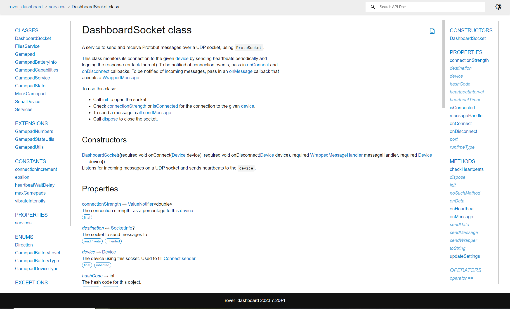

# Documenting code

Most languages have three types of comments

* **Inline comments**: `// like this` or `# like this`\
  Use these sparingly, and mainly to document one or a few unclear lines of code
* **Multiline comments:** `/* Like this */` or `""" Like this """`\
  Avoid these, as they are often out-of-context and inaccessible outside of the code
* **Doc comments:** `/// Like this` or `"""Like this, but in a function"""`\
  Use these on every function, class, and field

This section focuses on doc comments, which should be used to describe how to use your code to someone who is reading it for the first time.&#x20;

## Automation

All repositories have a GitHub workflow configured that scans the code for doc comments, compiles them into a clean and searchable website, and uploads it to the repository's documentation page. For example, you can find the Dashboard's documentation [here](https://binghamtonrover.github.io/Dashboard)

<figure><figcaption><p>The documentation page is in the <strong>About</strong> section</p></figcaption></figure>

For Dart repositories, the documentation looks like this:

<figure><figcaption><p>Documentation for some code in the dashboard</p></figcaption></figure>

## Documentation style

First off, **use proper English**. Full sentences, capitalization, etc. Look at the[ Flutter docs](https://api.flutter.dev/) for some really good examples of proper documentation. Structure your sentences as though you are the author of the code (even if you're only making small changes) and are talking to a reader who is trying to use your code or fix some sort of bug.&#x20;

Don't describe the actual implementation of your function; your code should do that well enough, with inline comments where needed. Instead, describe _how_ to use your function, when it should be called, and any side effects of calling it. Avoid saying "this function" or "this variable". For example,&#x20;

> ~~<mark style="color:red;">This function opens a connection to the dashboard.</mark>~~
>
> <mark style="color:green;">Opens a connection to the dashboard.</mark>

It can be helpful to first document any fields in your class, then methods/functions, and _then_ the class itself. The class docs shouldn't repeat anything  (except for a basic overview) but should instead reference your other docs. The function/field docs should describe what each member does but the class docs should describe how to use/construct/manage the class as a whole.

Your doc comments should be structured like this:&#x20;


```dart
/// One (and only one) sentence briefly describing your function/field/class.
///
/// More paragraphs to add details where needed so the brief can fit on one line. 
/// Not everything needs more details, so use these sparingly to ensure readers 
/// actually read them. These paragraphs can use markdown text, like **bold** and 
/// _italics_. Be sure to use triple slashes between paragraphs.
///
/// Your first paragraph should have detail at a high level of what your code is 
/// doing and a bit on how it does it. If needed, include another paragraph 
/// describing how users should use your code. For class docs, it is often helpful 
/// to use a list to quickly mention each member of importance, like this:
/// 
/// - This is element #1
/// - This is element #2
///
/// Try to include enough detail for the reader to be able to diagnose common bugs,
/// but don't walk the reader through every line of code. Just the big ideas.
```


### References

To provide a coherent docs experience, be sure to reference other documentation where relevant. For example,

```dart
/// A class you might find yourself writing or refactoring.
///
/// Initialize this class with [init] and be sure to call [dispose] when you are
/// done with the object.
class MyClass {
  /// This function allocates space needed by this class.
  void init() { /* ... */ }
  /// This function frees memory allocated by [init].
  void dispose() { /* ... */ }
}
```

The documentation tools (either Doxygen or DartDocs) will automatically insert a link to the relevant page when you include a reference. In Doxygen, the syntax is `#MyClass`or `MyClass::Function`. Avoid using references excessively. For example,

```dart
/// Gets the orientation as an [Orientation] object.
Orientation getOrientation() { /* ... */ }
```

The doc pages already show the return type and parameter types, so save references for code that isn't part of the code you are documenting, like other functions and side effects.&#x20;
